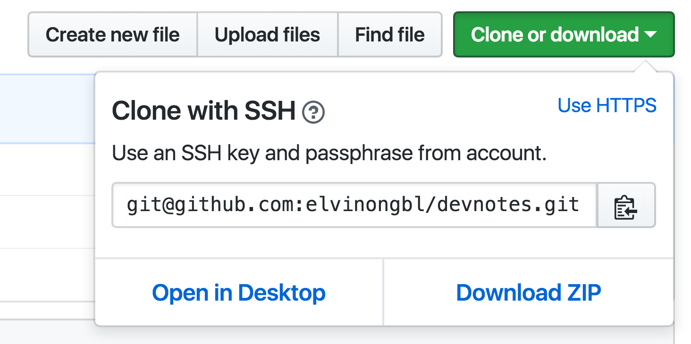

# Overview
This is my quick personal notes that I have gathered all these years when
I am dealing with Linux-based OS and system.

# Table of Content

[Networking](#networking)
  - [Setting-up SSH Access](#setting-up-ssh-access)

[GitHub Setup](#github-setup)

[Performance Gathering](#performance-gathering)
  - [iperf3](#iperf3)


# Networking

## Setting-up SSH Access

1) Install openssh-client & ssh-agent-filter
```
sudo apt-get install openssh-client ssh-agent-filter
```

2) Generate Your SSH key
```
ssh-keygen -t rsa -b 4096 -C "<somename>@<company.com>"
```
Note: the generated key are usually stored under ~/.ssh/

3) Register Your SSH public key with the server

Login into the account of where git repositories are hosted
and populate the public key from below output
```
cat ~/.ssh/id_rsa.pub
```

4) Test Your service access
```
ssh -T <user>@<server.com>
```

5) Start ssh-agent
```
eval $(ssh-agent -s)
```

6) Add private key to ssh-agent
```
ssh-add ~/.ssh/id_rsa
```

7) Check SSH_AUTO_SOCK and SSH_AGENT_PID are valid
```
echo ${SSH_AUTO_SOCK}
echo ${SSH_AGENT_PID}
```

Further read: github.com provides good SSH setup documentation.
Start with [GitHub SSH Setup](https://help.github.com/articles/connecting-to-github-with-ssh/)

# GitHub Setup

1) After you have setup your SSH public key with your GitHub account, please
make sure that you choose "Clone with SSH" instead of "Clone with HTTPS". This
prevents you from entering username and password everytime you need to push
commits back to GitHub repositories.



The URL for the git clone should look like below:
```
git@github.com:<user-name>/<project-name>.git
```

If you are not sure, how to check the URL that you have used before in other
repositories, you can use below command to check out:-

```
git remote -v
```

2) To allow other contributors to be able to push to GitHub repositories,
in respective project "settings" page and choose collaborators tab for add their
GitHub account names there.

# Performance Gathering

## iperf3

For more details about using iperf3 for collecting network throughput and latency,
please see [docs/iper3](docs/iperf3.md).
