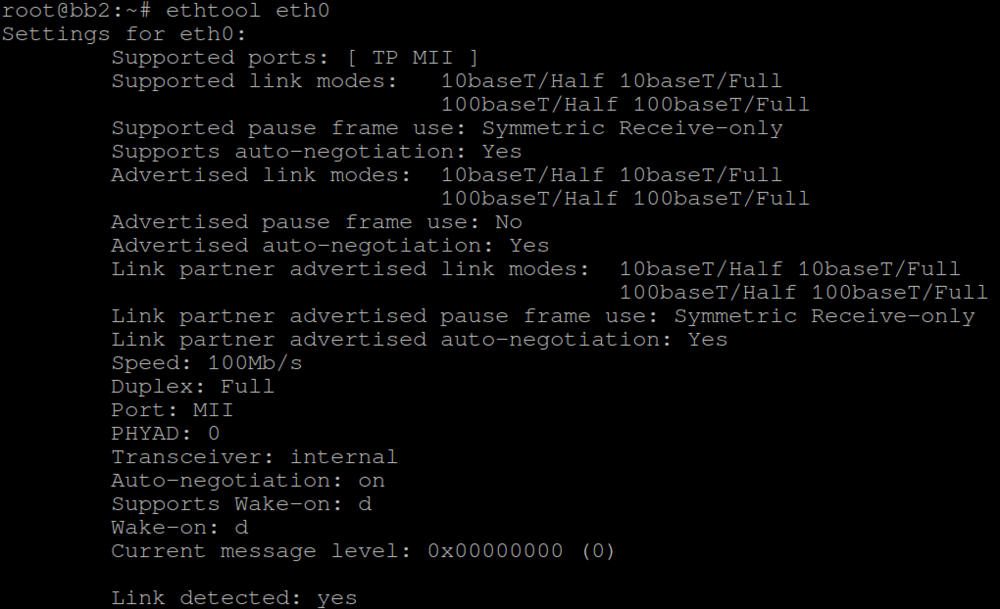

# A) Overview

  - [Installation](#installation)
  - [Show Basics Network Device Information](#show-basics-network-device-information)

# 1) Installation

For Ubuntu system, simply run below command:

```
sudo apt-get install ethtool
```

For Yocto Project-built Linux OS, to pre-install ethtool on target OS, please
make sure:-

 - conf/local.conf    : IMAGE_INSTALL += "ethtool"

# 2) Show Basics Network Device Information

To show basic network device informations such as auto negotiation, link status,
speed, duplex mode & etc, we use

```
# Show device node available on your system.
ifconfig
# Select a device node for below command.
ethtool <devname>
```



