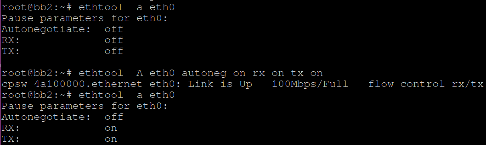

# A) Overview

  - [Installation](#installation)
  - [Show Basics Network Device Information](#show-basics-network-device-information)

# 1) Installation

For Ubuntu system, simply run below command:

```
sudo apt-get install ethtool
```

For Yocto Project-built Linux OS, to pre-install ethtool on target OS, please
make sure:-

 - conf/local.conf    : IMAGE_INSTALL += "ethtool"

# 2) Show Basics Network Device Information

To show basic network device informations such as auto negotiation, link status,
speed, duplex mode & etc, we use

```
# Show device node available on your system.
ifconfig
# Select a device node for below command.
ethtool <devname>
```


# 3) Pause Frame

IEEE 802.3x defines a mechanism for temporarily stopping the transmission of
Ethernet data. To display flow control state of Ethernet port and setting them
independently, we use:-

```
# To show
ethtool -a <devname>
# To change flow control of device
ethtool -A <devname> [autoneg on|off] [rx on|off] [tx on|off]
```



# 4) Interrupt Coalesce

Interrupt coalesce is meant to regulate interrupt firing due to Tx & Rx packets.

```
# To show coalesce state of an Ethernet device
ethtool -c <devname>
```


```
# To modify coalesce controls
ethtool -C <devname> \
[adaptive-rx on|off] [adaptive-tx on|off] \
[rx-usecs N] [rx-frames N] [rx-usecs-irq N] [rx-frames-irq N] \
[tx-usecs N] [tx-frames N] [tx-usecs-irq N] [tx-frames-irq N] \
[stats-block-usecs N] \
[pkt-rate-low N]  [rx-usecs-low N]  [rx-frames-low N]  \
                  [tx-usecs-low N]  [tx-frames-low N]  \
[pkt-rate-high N] [rx-usecs-high N] [rx-frames-high N] \
                  [tx-usecs-high N] [tx-frames-high N] \
[sample-interval N]
```
