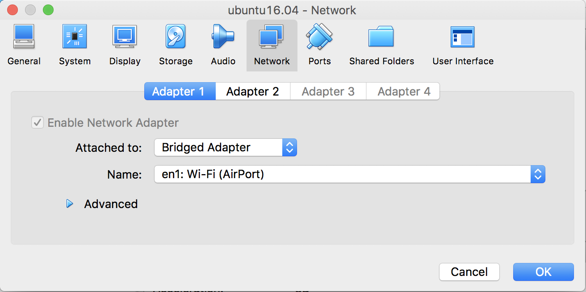
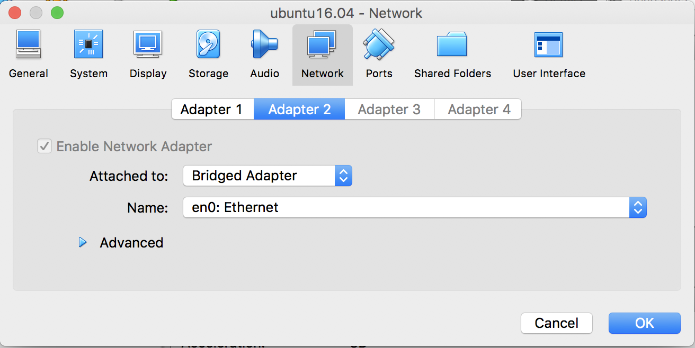
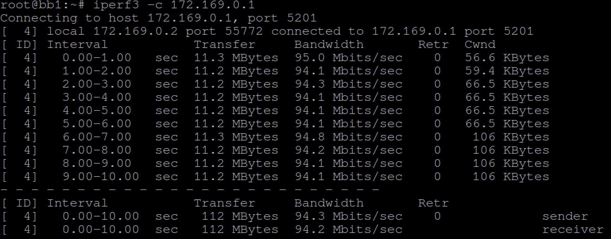
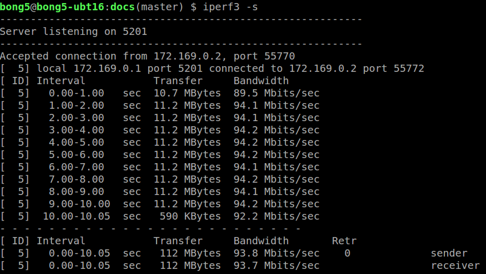
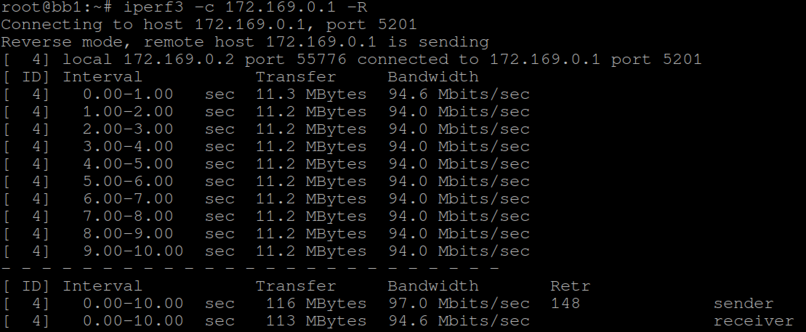
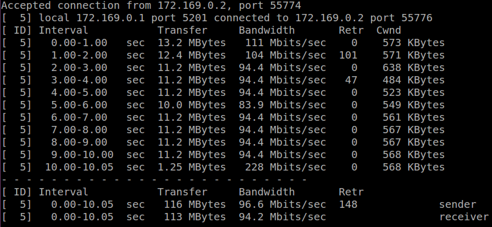
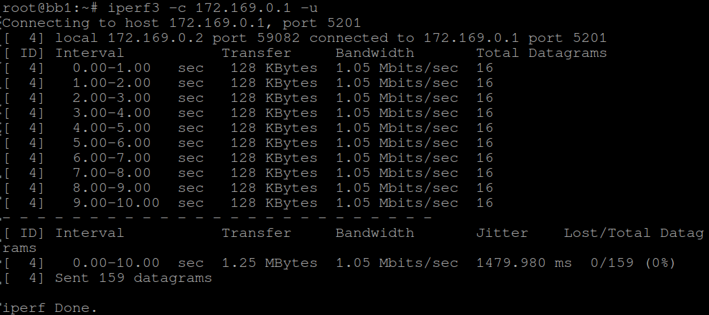
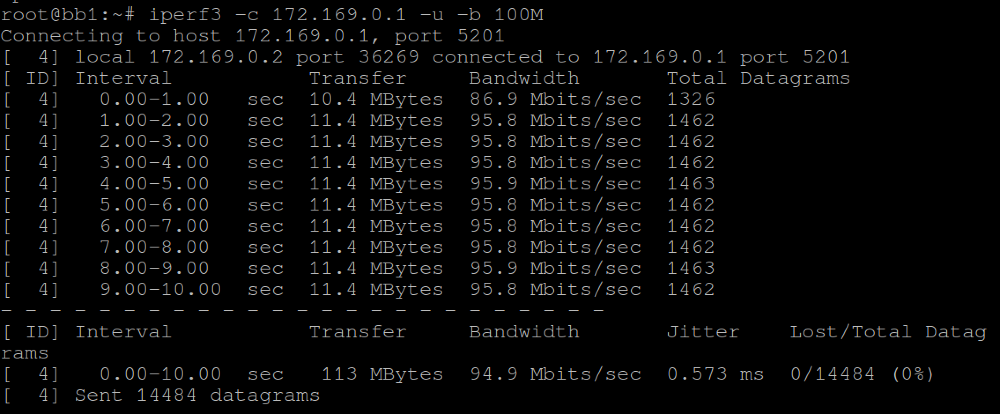

# A) Setup

## 1) Server

iperf3 measures throughput between server and client. To ensure that measurement
is not poor due to computing bottle-neck in server, it is advisable that server
is running on machine of higher computing power.

To install iperf3 on Ubuntu machine
```
sudo apt-get install iperf3
```

For Yocto Project-built Linux OS, to pre-install iperf3 on target OS, please
make sure:-

 - conf/bblayers.conf : include path to meta-openembedded/meta-oe
 - conf/local.conf    : IMAGE_INSTALL += "iperf3"

### 1.1(a) Linux VM with dual network adapters

You may also setup such that a Linux VM is serving as server. In my current
setup, I allocate two network interfaces to my Linux VM as shown below:

1) 1st adapter is attached to bridged adapter of the Wi-Fi port.



This adapter shall be used for general access to Internet.

2) 2nd adapter is attached to bridged adapter of the Ethernet port.



This adapter shall be used to connect to DUT for iperf measurement.

Note:

IP addresses for server and client are statically assigned below:-

iperf3 server :- 172.169.0.1

iperf3 client :- 172.169.0.2

### 1.1(b) Setting IP address for the 2 adapters at Linux VM

Assuming 1st adapter is enp0s3 and 2nd is enp0s8, we configure
/etc/network/interfaces as:-

Note: use 'sudo ifconfig' to figure out what is device name of the
network adapters.

```
auto enp0s8
iface enp0s8 inet static
    address 172.169.0.1
    netmask 255.255.255.0

auto enp0s3
iface enp0s3 inet dhcp
```
Note: for statically assigned IP address, please don't set gateway to
the IP address of your DUT because this will cause confusion in Linux
IP route table.

Fire up both network adapters at server end:
```
sudo ifdown enp0s3
sudo ifdown enp0s8
sudo ifup enp0s3
sudo ifup enp0s8
```

Check that IP routing table is properly setup and you still can ping
a server on Internet:
```
route
ping www.google.com
```
Notes: the settings in /etc/network/interfaces are stateful and there
is no need for restarting of network adapters on future system start-up.

## 2) Client (DUT)

Assuming Ethernet network adapter for device under test (DUT) is eth0,
/etc/network/interfaces shall be configured as:-
```
auto eth0
iface eth0 inet static
    address 172.169.0.2
    netmask 255.255.255.0
```

Start network adapter at client end (DUT):
```
sudo ifdown eth0
sudo ifup eth0
```
Notes: the settings in /etc/network/interfaces are stateful and there
is no need for restarting of network adapters on future system start-up.

# B) Testing

## 1) iperf3 client is sending

Server-side:
```
iperf3 -s
```

Client-side:
```
iperf3 -c <server IP address>
```

Screen-shots:-

Client-side:



Server-side:



## 2) iperf3 server is sending

Server-side:
```
iperf3 -s
```

Client-side:
```
iperf3 -c <server IP address> -R
```

Screen-shots:-

Client-side:



Server-side:



## 3) iperf3 server and client are sending to each other

Server-side:
```
iperf3 -s
```

Client-side:
```
iperf3 -c <server IP address> -d
```

## 4) Setting to use UDP instead of TCP (default)
Server-side:
```
iperf3 -s
```

Client-side:
```
iperf3 -c <server IP address> -u
```

Note: Using UDP instead of TCP is a great way to measure network latency
and stability of network. This is because TCP provides ack & retry which
UDP does not have.



By default, UDP traffic is throttled at lower bandwidth. Observe that the
jitter is also high.

To increase the bandwidth allocated for UDP, we can use option '-b'
as shown below:

Client-side:
```
iperf3 -c <server IP address> -u -b n<K|M>
```



Observe that when the bandwidth allocated to UDP increases network jitter
reduces.
