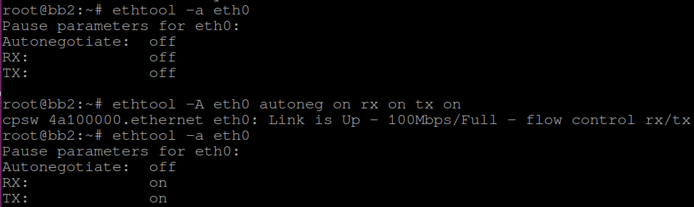
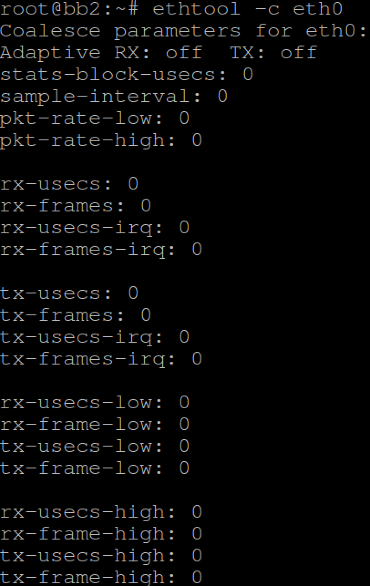
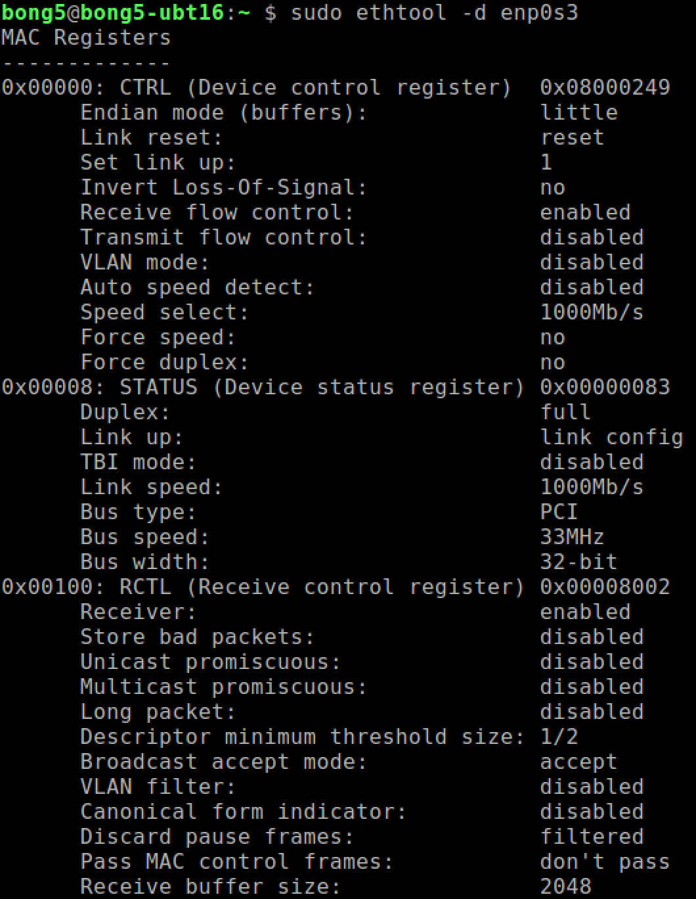
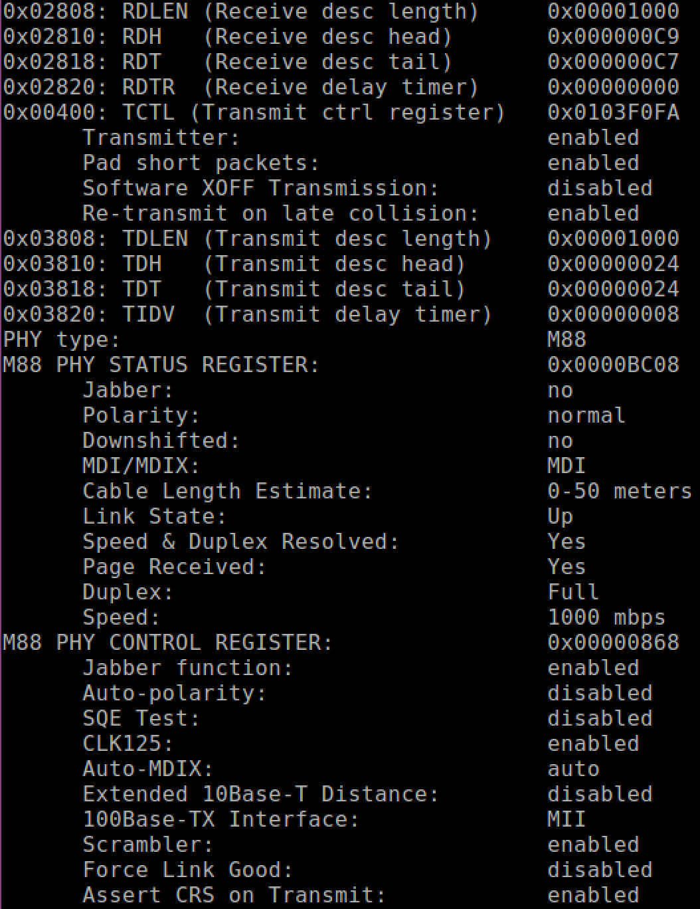
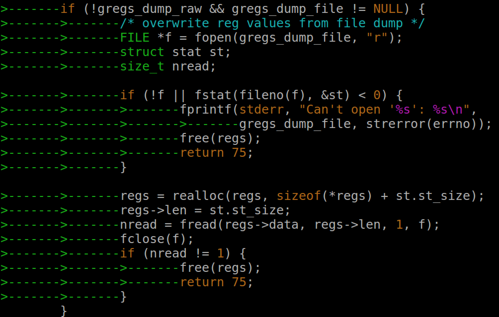
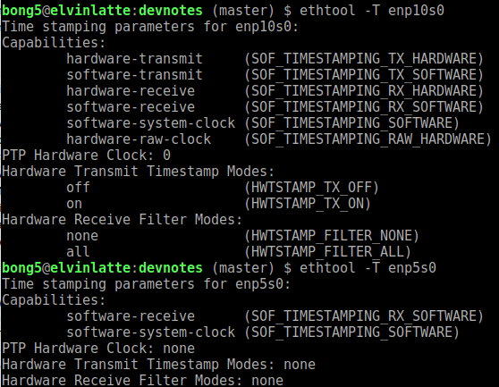

# A) Overview

  - [Installation](#1a-installation)
  - [Build From Source](#1b-build-from-source)
  - [Show Basics Network Device Information](#2-show-basics-network-device-information)
  - [Pause Frame](#3-pause-frame)
  - [Interrupt Coalesce](#4-interrupt-coalesce)
  - [Dump registers](#5-dump-registers)
  - [Time Stamping](#6-time-stamping)

# 1a) Installation

For Ubuntu system, simply run below command:

```
sudo apt-get install ethtool
```

For Yocto Project-built Linux OS, to pre-install ethtool on target OS, please
make sure:-

 - conf/local.conf    : IMAGE_INSTALL += "ethtool"

# 1b) Build From Source

Ethtool is developed in parallel with the development of Linux kernel mainline.
So, check that your Linux kernel version by using 'name -a' and make sure that
you check out the right tag that matches your system kernel version. You can
list the project tag by using 'git tag'.

```
git clone git://git.kernel.org/pub/scm/network/ethtool/ethtool.git
# In addition to basic software packages needs to compile Linux
sudo apt-get install automake
cd ethtool
# To list project tags
git tag
# To checkout the right tag of your kernel project
git checkout <tag of your kernel version>
./autogen.sh
./configure
make
sudo make install
```

# 2) Show Basics Network Device Information

To show basic network device informations such as auto negotiation, link status,
speed, duplex mode & etc, we use

```
# Show device node available on your system.
ifconfig
# Select a device node for below command.
ethtool <devname>
```


# 3) Pause Frame

IEEE 802.3x defines a mechanism for temporarily stopping the transmission of
Ethernet data. To display flow control state of Ethernet port and setting them
independently, we use:-

```
# To show
ethtool -a <devname>
# To change flow control of device
ethtool -A <devname> [autoneg on|off] [rx on|off] [tx on|off]
```



# 4) Interrupt Coalesce

Interrupt coalesce is meant to regulate interrupt firing due to Tx & Rx packets.

```
# To show coalesce state of an Ethernet device
ethtool -c <devname>
```



```
# To modify coalesce controls
ethtool -C <devname> \
[adaptive-rx on|off] [adaptive-tx on|off] \
[rx-usecs N] [rx-frames N] [rx-usecs-irq N] [rx-frames-irq N] \
[tx-usecs N] [tx-frames N] [tx-usecs-irq N] [tx-frames-irq N] \
[stats-block-usecs N] \
[pkt-rate-low N]  [rx-usecs-low N]  [rx-frames-low N]  \
                  [tx-usecs-low N]  [tx-frames-low N]  \
[pkt-rate-high N] [rx-usecs-high N] [rx-frames-high N] \
                  [tx-usecs-high N] [tx-frames-high N] \
[sample-interval N]
```

# 5) Dump Registers

ethtool may dump registers to standard out in various formats:
  a) Decoded (default): decoding dependent on driver implementation
  b) Raw (raw on): may be edited and read-back for decoding
  c) Heximal (hex on): not available for read-back for decoding, so no point post-editing.

 - **Decoded format**

```
ethtool -d <devname>
```




 - **Editing & Read-back Raw format**

```
ethtool -d <devname> raw on > dump-raw.txt
hexedit dump-raw.txt
ethtool -d <devname> hex on file dump-raw.txt
ethtool -d <devname> file dump-raw.txt
```
Note: If you have not installed hexedit, perform the following command in Ubuntu.
```
sudo apt-get install hexedit
```

 - **Hex format**

```
ethtool -d <devname> hex on > dump-hex.txt
vi dump-hex.txt
ethtool -d <devname> hex on file dump-hex.txt
```
Note: You will realize that editing hex format content is not working
correctly as the read-back mode implemented in ethtool project expects
a raw format output as shown below:-



# 6) Time Stamping

Time stamping is important to improve the accuracy of time synchronization between
two end stations by using technique described in IEEE1588 Precision Time Protocol
(PTP). Time stamping can be done by software (in kernel) or hardware
(MAC controller).

To show the time-stamping capability of an Ethernet controller:-
```
ethtool -T <network interface>
```



Goto [main](https://github.com/elvinongbl/devnotes)
