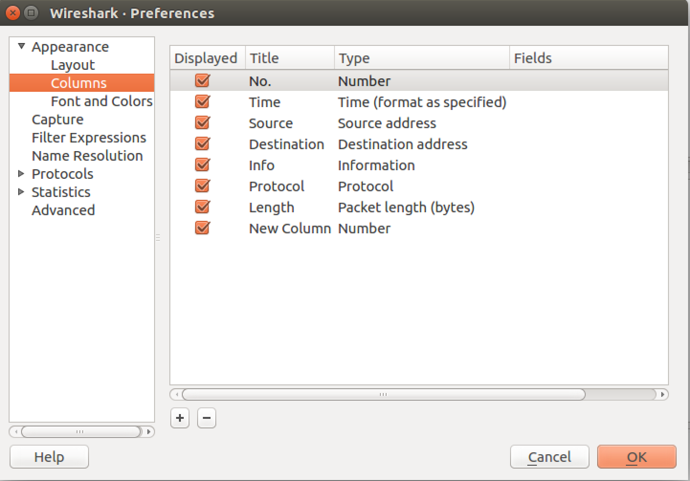
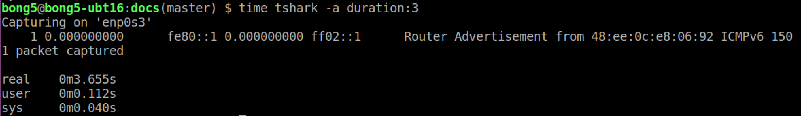
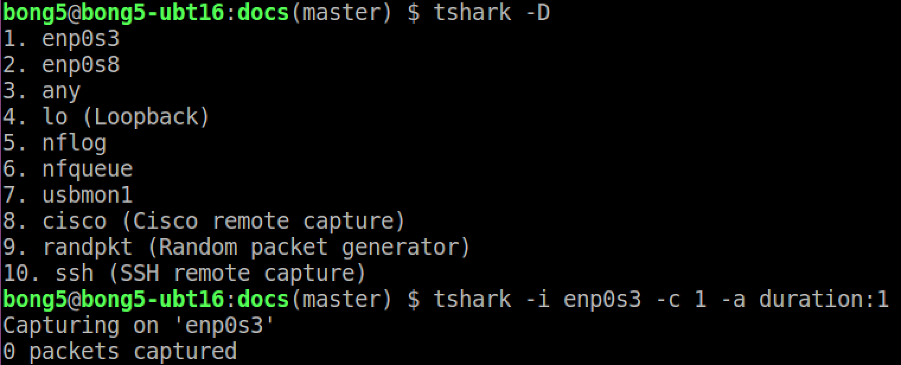
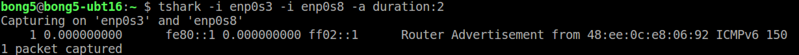

Table of Contents

- [Setup](#setup)
- [Start-up wireshark](#start-up-wireshark)
- [Add New Time Delta Column](#add-new-time-delta-column)
- [tshark (Console Version of Wireshark)](#tshark-console-version-of-wireshark)
  * [tshark and Lua Scripting](#tshark-and-lua-scripting)

# Setup

To install wireshark from standard Ubuntu build (tested with 16.04) and
set it up such that non-supervisor user can start wireshark, we need to
make sure wireshark group is added to a user's group.

```
sudo apt-get install wireshark
sudo usermod -a -G wireshark <user-name>
# Log-out and re-login to system again
# and check that wireshark is enlisted to a user's group
groups
```

# Start-up wireshark

To start wireshark, simply type below:-

```
wireshark &
```


# Add New Time Delta Column

1) Right click on column and choose column preferences:-


2) Add a new column by clicking on '+' button:-


3) Change the column 'name' and choose 'time-delta' for 'type', then click 'OK':-


4) You may also press and drag newly created column to the position you desired:-


# tshark (Console Version of Wireshark)

tshark is the console version of Wireshark, a network protocol analyzer.
It captures network packets in pcap format, the same format used in tcpdump.

To install tshark on Ubuntu machine, type:-
```
sudo apt-get install tshark
```

Some examples of tshark common usages:-

- **To capture a limited number of network packets**
```
tshark -c [number of packets]
```

- **To limit captures according to duration (in seconds)**
```
tshark -a duration:X
```


- **To list network interfaces and use one for packet capturing**
```
tshark -D
tshark -i <name of interface listed above>
```


We may also specify multiple interfaces as shown below:


Note: If there is no network interface selected, tshark selects the 1st non-loopback
interfaces.

- **To list supported file format for capture**

By default, tshark stores captures in pcap format which is the same format
used in tcpdump.

 * To list supported file format

```
tshark -F
```


 * To write capture to a file using 'pcapng' format with comment.

Note: capture comment only available in pcapng.
```
tshark -F pcapng -w <file.pcapng> --capture-comment "Your comment here"
wireshark <file>
```

- **To put an interface as monitor mode**

Note: the following steps do not work for network interface on virtualization.

When an interface enters monitor mode, it disassociates itself from the network
and enter into monitoring network packets. It enters stealth mode where no more
external network access is possible.

If we want all interfaces to be in monitor mode, place -I ahead of -i.
```
tshark -I -i <I/F-1> -i <I/F-2>
```
If we want to specify only one interface to enter monitor mode:
```
tshark -i <I/F-1> -I -i <I/F-2>
```

## tshark and Lua scripting

For more notes on Lua scripting for Wireshark, please see [docs/tshark-lua](tshark-lua.md)
