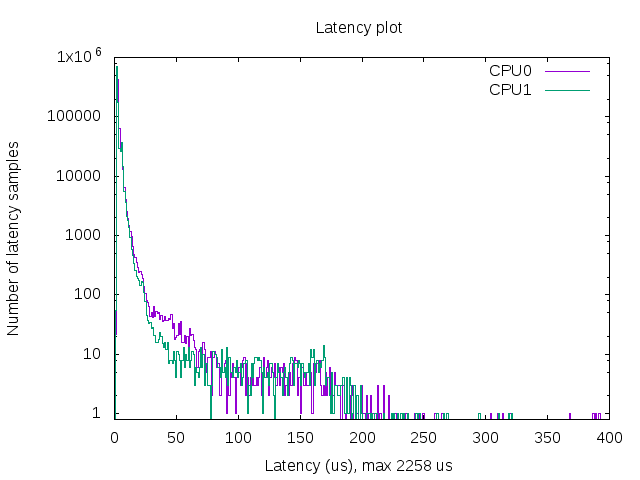
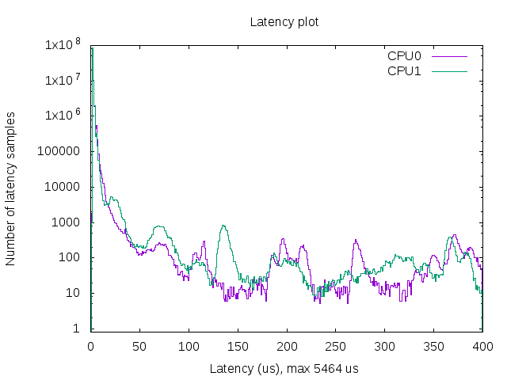
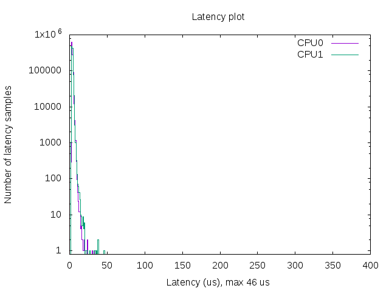
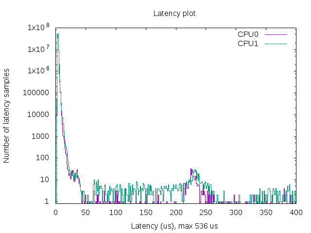

# Overview
cyclictest is part of 'rt-tests' software package under Ubuntu OS.

cyclictest has one main non real-time master thread (SCHED_OTHER)
and many real-time priority multiple threads (SCHED_FIFO). These
real-time threads are activated at a defined interval by an expiring
timer (cyclic alarm). Whenever a real-time is woke-up, it reports its
current time to master thread. Therefore, any difference between
the expected and actual wake-up time for these real-time threads are
recorded: min, max & average.

# Installation
```
sudo apt-get install rt-tests
```

# A good script and cyclictest results

There is a good cyclictest script provided in OSADL webpage below:-

https://www.osadl.org/uploads/media/mklatencyplot.bash

Edit the downloaded bash script at below locations:

```
# to change the number of iterations you want cyclictest to run:-
# -l100000000 is about 5hrs
# -l1000000 is about 10mins
-cyclictest -l100000000 -m -Sp90 -i200 -h400 -q >output
-cyclictest -l1000000 -m -Sp90 -i200 -h400 -q >output

# to automatically set it to the number of cpus you have
-cores=4
+cores=$(nproc)
```

Below are the results that I have run on UP2 board - N3350

## Non-realtime OS for 1,000,000 iterations


## Non-realtime OS for 100,000,000 iterations


## PREEMPT_RT OS for 1,000,000 iterations


## PREEMPT_RT OS for 100,000,000 iterations


# Good URLs
 - https://wiki.linuxfoundation.org/realtime/documentation/howto/tools/cyclictest
 - https://www.osadl.org/Create-a-latency-plot-from-cyclictest-hi.bash-script-for-latency-plot.0.html?&no_cache=1&sword_list[0]=script


Goto [main](https://github.com/elvinongbl/devnotes)
