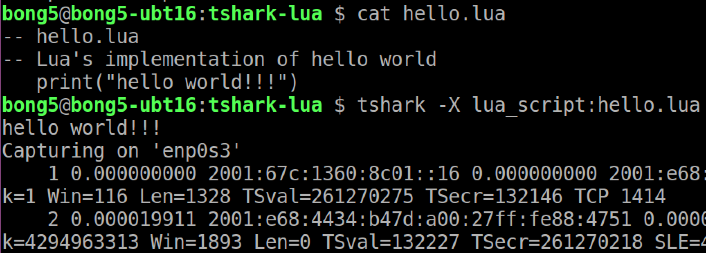

Table of Contents

- [Introduction](#introduction)
- [Global Configuration](#global-configuration)

# Introduction

Writing Wireshark script in Lua is good for fast prototyping functions such
as for (1) dissectors, (2) post-dissectors & (3) taps. However, if users
would like high performance dissectors, the logics implemented in Lua should
be ported into C language.

To ask tshark to execute Lua script, we use:-
```
tshark -X lua_script:<xyz.lua>
```

For example, running a hello world Lua script:-



# Global Configuration
The global configuration of Wireshark Lua engine is located at
/etc/wireshark/init.lua, which is also symbolic linked from
/usr/share/wireshark/init.lua.

There are two variables worth mentioning here:-

 - **disable_lua = false**
   * use to disable Lua engine if true
 - **run\_user\_scripts\_when\_superuser = false**
   * use to control if user scripts can be executed by superuser
   * set this to true if you intend to allow superuser to use script owned by user.

Next, ~/.config/wireshark/init.lua script is executed before eventually running
the script passed with -X lua_script:xyz.lua as shown below:


