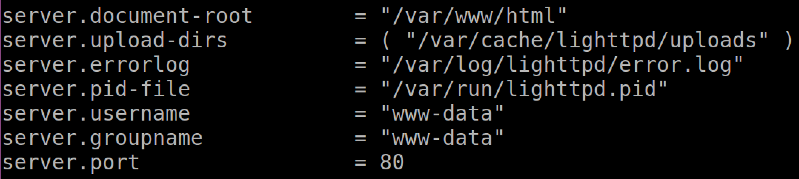
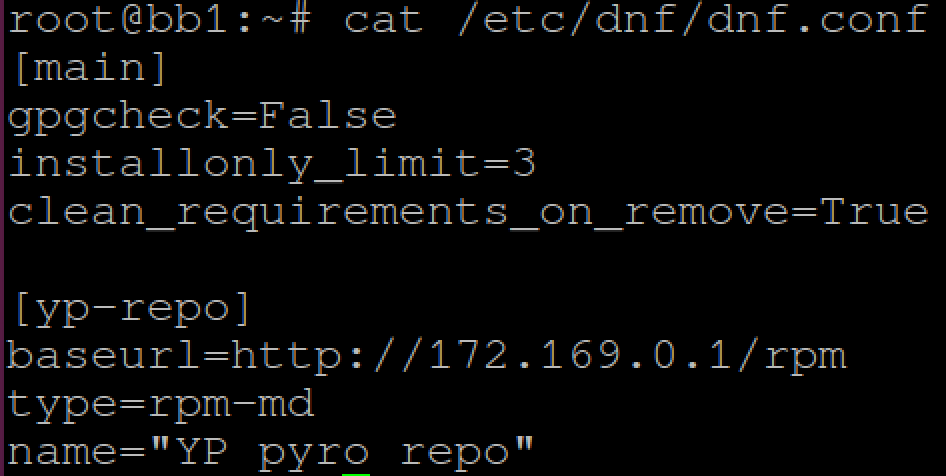

# A) Adding package manager to target image by default [build machine]

## 1) conf/local.conf changes

To add software package manager to target image by default, please make sure
the following settings are set:-

```
PACKAGE_CLASSES ?= "package_rpm"
EXTRA_IMAGE_FEATURES ?= "debug-tweaks package-management"
```

Note: if we want to support other package format types, we may change the
default value set for PACKAGE_CLASSES as shown below:

```
PACKAGE_CLASSES ?= "package_rpm package_deb package_ipk"
```

In the following example, we are using RPM format as illustration.

## 2) Rebuild target image and create package management index

We need to rebuild target image after we have made changes to local.conf.
For example:-
```
bitbake core-image-sato
```

Next, to make sure package management index is updated. Please always remember
to perform below step each time after your rebuild software packages so that
the index is always updated.

```
bitbake package-index
```

# B) Setting up HTTP server [build machine]

For Ubuntu machine, we shall use lighttpd as a light-weight HTTP server.

```
sudo apt-get install -y lighttpd gamin
```

Next, we shall create a symlink from default HTML web hosting path defined in
/etc/lighttpd/lighttpd.conf to the package repository under tmp/deploy

```
mkdir -p /var/www/html
sudo ln -s <path-to-build-folder>/tmp/deploy/rpm /var/www/html/rpm
```

Note: the default path for lighttpd may vary across version. So, it is
important to make sure the path is set correctly. Example of lighttpd.conf is:



Finally, we restart lighttpd service so that it reload its configuration

```
sudo service lighttpd reload
```

# C) Setting up DNF configuration [target machine]

After the newly rebuilt target image has been flashed and rebooted, we need
configure /etc/dnf/dnf.conf as shown below.



# D) Basic DNF commands and usages [target machine]

To automatically updates database from package repositories hosted at build machine:
```
dnf repolist -v
```

To search for package
```
dnf search <package name or string to match>
```

To install a package
```
dnf install <package name>
```

To remove a package
```
dnf remove <package name>
```

To update cached metadata and database and sync it from package repositories
server again:-
```
dnf clean all
dnf search <new package>
dnf install <new package>
```

